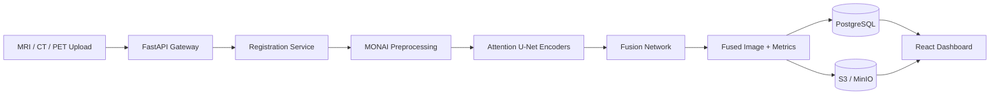

# Deep-Med-Fusion

Intelligent Multi-Modal Medical Image Fusion with Attention Mechanisms.

Deep-Med-Fusion is a production-oriented reference platform for fusing MRI, CT, and PET scans into a single high-quality composite image. It combines a FastAPI clinical workflow backend, PyTorch/MONAI-style AI services, PostgreSQL metadata storage, S3-compatible object storage, and a React TypeScript dashboard.

> This repository is a working scaffold for research and engineering. It is not a certified medical device and must not be used for diagnosis without clinical validation, regulatory review, and institutional approval.

## Key Capabilities

- Multi-modal study ingestion for MRI, CT, PET, and fused outputs
- Registration and preprocessing pipeline hooks
- Attention U-Net encoder and fusion network implementation
- Fusion quality metrics including PSNR, SSIM, and perceptual-loss placeholder
- Batch job orchestration for clinical workflows
- PostgreSQL schema with audit logging and model versioning
- React dashboard for job monitoring and result inspection
- Docker Compose local stack with API, frontend, PostgreSQL, and MinIO
- Architecture diagrams and deployment starter files

## Architecture



## Repository Layout

```text
Deep-Med-Fusion/
  frontend/          React + TypeScript clinical dashboard
  backend/           FastAPI API, workflow services, schemas
  ai-services/       Deep learning, preprocessing, inference, evaluation
  database/          PostgreSQL schema and migrations
  infrastructure/    Docker, AWS, Terraform, monitoring
  docs/              Architecture, API, research notes
```

## Quick Start

```bash
docker compose up --build
```

Services:

- Frontend: http://localhost:5173
- Backend API: http://localhost:8000/docs
- PostgreSQL: localhost:5432
- MinIO: http://localhost:9001

## Local Backend

```bash
cd backend
python -m venv .venv
.venv\Scripts\activate
pip install -r requirements.txt
uvicorn app.main:app --reload
```

## Local Frontend

```bash
cd frontend
npm install
npm run dev
```

## Target Metrics

The project includes metric calculation utilities and benchmark documentation for:

- PSNR
- SSIM
- Perceptual loss
- Fusion consistency
- Batch throughput

The headline impact goals are encoded in docs as targets: 92% fusion quality, 40% faster review workflow, encrypted HIPAA-aligned data handling, and scaling toward 1000+ scans/day.

## Datasets

Dataset adapters are scaffolded for BRATS and ISLES. Downloading and using these datasets requires accepting their respective data-use agreements.

## Security

- PHI-safe audit log schema
- Encryption configuration placeholders
- S3 object key separation by tenant/study
- RBAC-ready API structure

## License

MIT. Clinical deployment requires independent validation.
