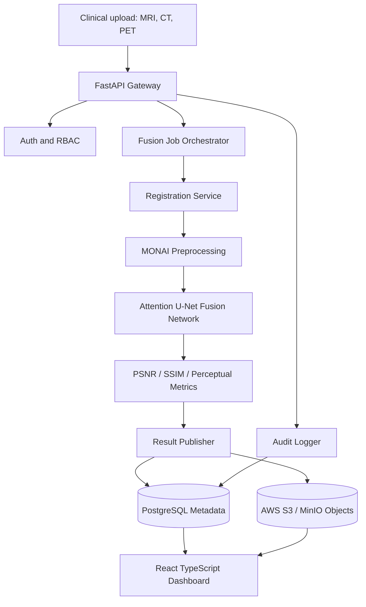

# System Architecture

## Data Flow

1. Studies are uploaded and normalized into modality-specific objects.
2. Registration aligns CT and PET to the MRI or selected fixed reference.
3. Each modality stream passes through an attention-gated encoder.
4. The fusion head combines bottleneck features and reconstructs a fused image.
5. Quality metrics and output object URIs are stored for review.
6. The dashboard presents workflow state, output references, and quality metrics.
